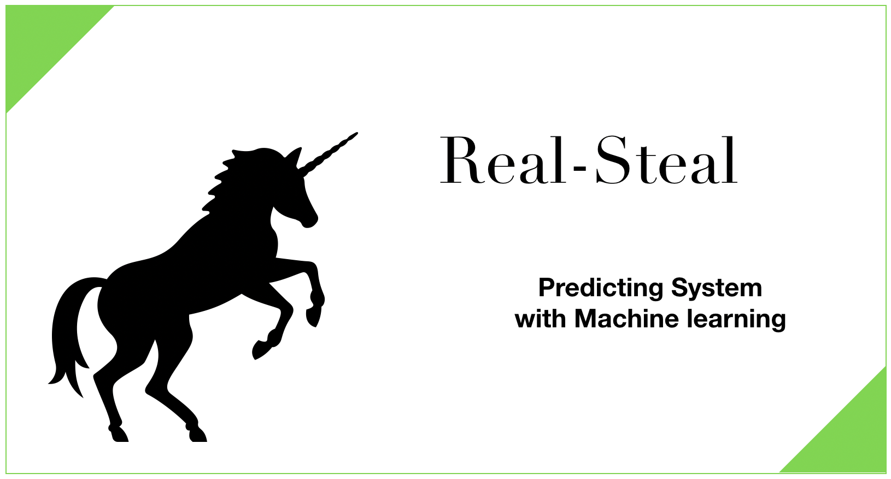

# REAL-STEAL

[]()
[](https://github.com/kiwamizamurai/kz-jpylb/blob/d5ed93cd042dc80582cf037a909a0c0bc80824da/LICENSE)
[]()
[]()
<br>



## What is REAL-STEAL?

Real-Steal is a project which is aiming for predicting horse racing with **Machine Learning**. 
Actuary, I'm into programing ranging from front-end to back-end, so I had considered creating some web services or IOS app.
But, taking my background or experiences into consideration, I decided to focus on Horse Racing. 
It is because that I've been studying Machine Learning.

Tha being said, I am still a beginner. It means there might be some mistakes. 
Thus, If you have some advice or request, please feel free to leave [issues](https://github.com/kiwamizamurai/REAL-STEAL/issues).


# Directory Structure
```
kz-jpylb
    ┣ work
    ┃   ┣ test1.ipynb
    ┃   ┗ test2.ipynb
    ┣ jupyter                # Jupyter Stuffs
    ┃   ┗ Dockerfile
    ┣ kzdb                   # Database Stuffs
    ┃   ┣ ...
    ┃   ┗ kzbase             # Example Table
    ┣ src                    # sources .py
    ┃   ┣ ...
    ┃   ┗ scraping.py
    ┣ README.md              # Instruction Manual
    ┣ LICENSE
    ┣ my.conf
    ┣ .env.example           # You have to modify, look at a detail below
    ┣ .gitignore
    ┗ docker-compose.yml
```


## 1. Installing Docker
General installation instructions are
[on the Docker site](https://docs.docker.com/installation/), but we give some
quick links here:

* [OSX](https://www.docker.com/docker-mac)
* [Windows](https://www.docker.com/docker-windows)

### 2.1 Modify your own UID
Linux/MacOS:

    $ echo $UID
    501  (yours might be different from mine)

After executing above command, you should follow the instructions:
1. Open `.env.example`
2. Modify `UID=501`  (this number was acquired above)
3. Rename `.env.example` to `.env`

That's all.


### 2.2 run a new Docker container
Windows/Linux/MacOS:

    $ docker-compose up -d 
 
This container setup   
```    
Package            Version    
------------------ --------
beautifulsoup4     4.7.1   
conda              4.6.8  
matplotlib         3.0.3   
numpy              1.15.4  
pip                19.0.3  
requests           2.21.0 
scikit-image       0.14.2  
scikit-learn       0.20.3  
scipy              1.2.1   
seaborn            0.9.0  
SQLAlchemy         1.3.1 
urllib3            1.24.1  
xgboost            0.82

etc...
```

### 3 How to use Jupyter Lab
Copy/paste this URL into your browser when you connect for the first time,

    http://localhost:8888/lab/?
    
if you want to use Jupyter-Notebook
    
    http://localhost:8888/?
    
    
### 4 How to use DataBase
Copy/paste this URL into your browser when you connect for the first time,

    http://localhost:8080/

Or, You can also use database as follows:

    $ docker-compose exec mysql-kz mysql -uroot -ppassword kzbase


    
    
### 5 End a Docker container
Windows/Linux/MacOS:

    $ docker-compose down

This container is CPU Only.If you want to use GPU, rebuilding GPU images requires [nvidia-docker](https://github.com/NVIDIA/nvidia-docker).
